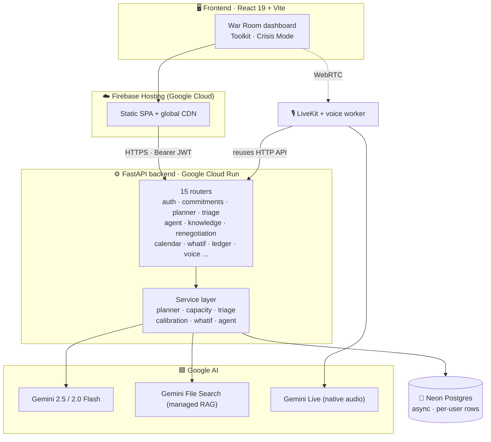
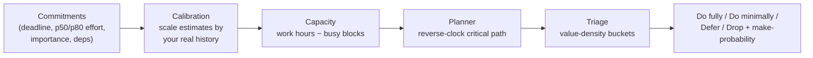
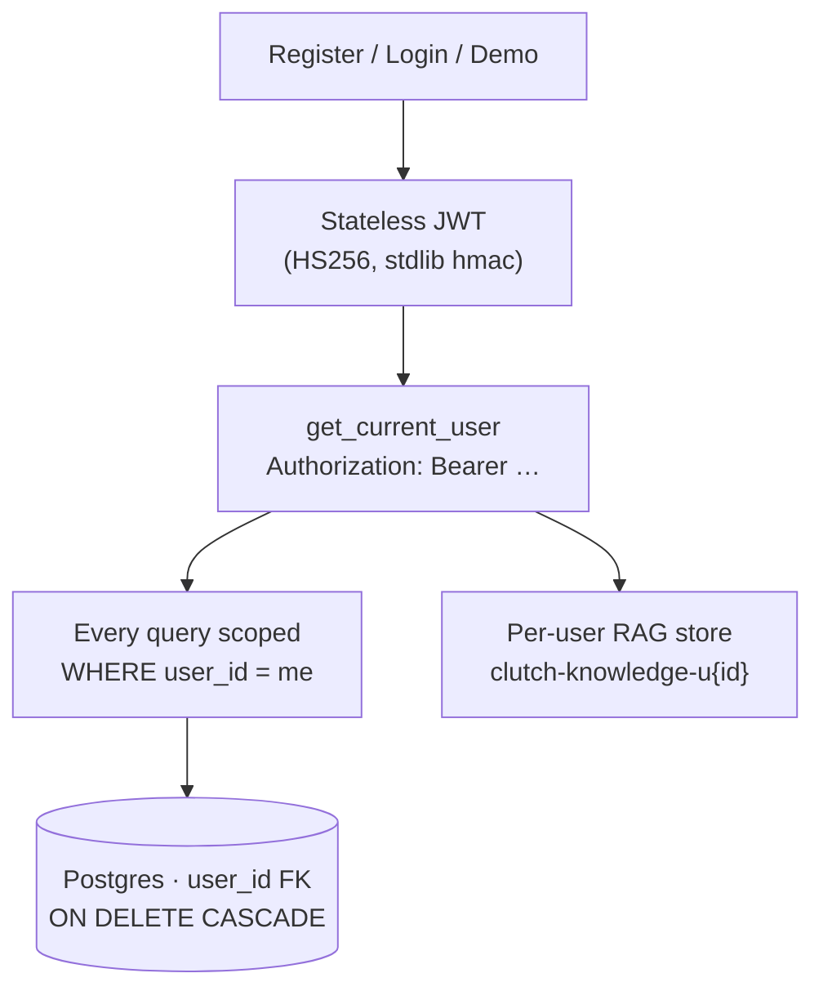
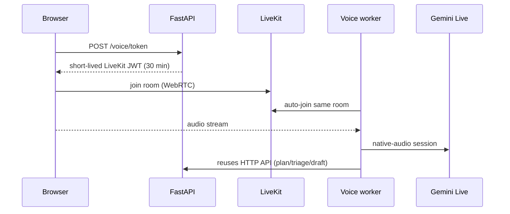
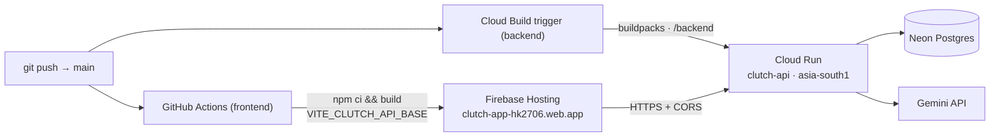

<aside>
🚨

**Clutch** is an AI **deadline-triage agent** for the moment you have *too much to do and not enough time*. It captures everything you owe, computes whether the next few days are actually survivable, decides what to do fully / minimally / drop, drafts the awkward "I need more time" emails, and explains every move in a reversible ledger.

</aside>

> **Stack at a glance:** React 19 + Vite (Firebase Hosting) · FastAPI + async SQLAlchemy (Google Cloud Run) · Neon Postgres · Google Gemini (`2.5-flash`, `2.0-flash`, Gemini File Search RAG, Gemini Live voice) · LiveKit voice worker.
> 

---

## 📚 Table of contents

- What problem it solves
- System architecture
- How Clutch thinks (the engine)
- Feature tour
- Multi-tenancy, accounts & per-user RAG
- Google / Gemini stack
- Data model
- API reference
- Frontend
- Voice Crisis Mode
- Configuration (environment variables)
- Deployment
- Local development
- Reliability & graceful degradation

---

## What problem it solves

When you're overloaded, the hard part isn't doing the work — it's **deciding** what's even possible and what to sacrifice. Clutch turns a messy pile of obligations into an honest plan:

1. **Capture** every commitment (typed, pasted text, a photo/screenshot, or voice).
2. **Decide** — given your real working hours and calendar, what fits? The triage engine ranks by value-density and tells you what to do fully, what to do at minimum-viable quality, what to defer, and what to drop.
3. **Act** — auto-decompose big tasks, draft renegotiation emails to stakeholders, and simulate "what if I drop this?" before you commit.
4. **Trust** — every state change is logged with reasoning and is one click to undo.

---

## System architecture



**Three deployables:**

| Tier | What | Where |
| --- | --- | --- |
| Frontend | React 19 SPA (static build) | **Firebase Hosting** (Google Cloud) |
| Backend API | FastAPI + async SQLAlchemy | **Google Cloud Run** — service `clutch-api`, region `asia-south1`, buildpacks, scale-to-zero |
| Database | Postgres | **Neon** (serverless, via asyncpg) |
| Voice worker *(optional)* | LiveKit Agents worker | any always-on host |

---

## How Clutch thinks (the engine)

The planning brain is **pure Python** (deterministic, testable) — Gemini is used for language, not for math.



### Capacity (real working time)

A `WorkPolicy` (timezone, `day_start_hour` 9, `day_end_hour` 23, `max_focus_hours_per_day` 10) defines reality. `available_minutes()` counts only minutes inside the daily work window, caps each day at the focus limit, and subtracts calendar **busy blocks**. `advance_working_minutes()` walks the clock forward, skipping nights and busy time — so projected finishes land on real availability, not wall-clock.

### Planner (reverse-clock critical path)

Topologically orders tasks (prerequisites first; ties broken by deadline then importance; dependency cycles fall back to deadline order). A **reverse pass** computes each task's latest safe start; a **forward pass** projects finishes on real working time using **two clocks** — a p50 (expected) and a p80 (worst-case, = `effort_p80_minutes` or **1.5×** the estimate). It outputs per-task risk (`on_track` / `at_risk` / `deficit`), total deficit minutes (p50 & p80), feasibility flags, and a `make_probability` of high / medium / low.

### Calibration (learns your optimism)

Over completed commitments it takes the **median of actual ÷ estimated** effort, clamps it to **0.25×–4×**, and only applies it once there are **≥ 3 samples**. It also reports a tendency: *underestimating / overestimating / well-calibrated*. Every plan is silently scaled by this factor.

### Triage (what to actually do)

Ranks pending work by **value-density = importance ÷ remaining minutes**, then fills the available-capacity budget:

- **Do fully** — fits the budget at full effort.
- **Do minimally** — importance ≥ 4, has a defined *minimum-viable definition*, and its MVD effort (**40%** of the estimate) fits.
- **Defer** — has a stakeholder to renegotiate with.
- **Drop** — everything else that can't fit.

---

## Feature tour

| # | Feature | What it does |
| --- | --- | --- |
| 1 | **Multimodal capture** | Type, paste messy text (`/commitments/parse`), or upload a screenshot/photo/PDF (`/commitments/parse-image`). Gemini extracts structured tasks, resolves relative dates ("Friday 5pm") to absolute ISO, and estimates effort + importance. |
| 2 | **Triage + plan** | The capacity-aware planner & triage engine described above. |
| 3 | **AI chief-of-staff agent** | A Gemini ReAct loop (`gemini-2.5-flash`, max 8 steps) with tools: read commitments, run the plan, run triage, search your knowledge base, draft a renegotiation. Calm, plain-language answers under 120 words. |
| 4 | **Triage buckets** | Value-density classification with minimum-viable shortcuts. |
| 5 | **Auto-decompose** | `POST /commitments/{id}/decompose` breaks a big task into a dependency-chained set of subtasks (inheriting deadline/importance/stakeholder) and defers the parent so effort isn't double-counted. Reversible. |
| 6 | **What-if simulator** | `POST /whatif` clones your world and replans against a scenario (drop / complete tasks, override deadlines or effort, add commitments, add focus time). Read-only; returns baseline vs scenario vs diff. |
| 7 | **Vision capture** | Gemini Vision reads tasks out of images/PDFs (syllabus, brief, whiteboard). |
| 8 | **Stakeholder-aware renegotiation** | Drafts (never auto-sends) subject + body emails tuned by tone and a stakeholder's relationship/formality. Optional one-click send via Gmail SMTP. |
| 9 | **Explainable decision ledger** | Every create/update/delete is recorded with a human reason and a JSON snapshot; reversible actions can be undone. |
| 10 | **Per-user knowledge base (RAG)** | Upload docs into a private Gemini File Search store and ask grounded questions with citations. |
| 11 | **Voice Crisis Mode** | Hands-free triage over WebRTC via Gemini Live (optional worker — see below). |

---

## Multi-tenancy, accounts & per-user RAG

Clutch is a real multi-user app — every account's data is fully isolated.



- **Auth** — `POST /auth/register` (409 if email exists), `/auth/login` (401 on bad creds), `/auth/demo` (one-tap demo account), `GET /auth/me`. Passwords are hashed with **PBKDF2-HMAC-SHA256, 200,000 rounds**; access tokens are hand-rolled **HS256 JWTs built only from the Python standard library** (`hmac` + base64url — no third-party JWT/crypto dependency). Default token TTL is **7 days**.
- **Isolation** — *every* table carries a `user_id` foreign key with `ON DELETE CASCADE`, and *every* query, plan, triage run, ledger entry and draft is filtered by the authenticated user. There is no shared global state.
- **Per-user RAG** — each user gets their **own Gemini File Search store** (`clutch-knowledge-u{user_id}`; the demo user uses `clutch-knowledge`). Uploads, searches and purges are all scoped to that store, so one user's documents can never surface in another's answers.

---

## Google / Gemini stack

| Capability | Google product / model | Where used |
| --- | --- | --- |
| Text parsing, vision, agent, decomposition, renegotiation | **Gemini 2.5 Flash** | `commitments/parse`, `parse-image`, `agent`, `decompose`, `renegotiation` |
| Generic JSON/text helper default | **Gemini 2.0 Flash** | `core/gemini` `generate_text` / `generate_json` |
| Retrieval-augmented knowledge base | **Gemini File Search** (managed chunking, embeddings, retrieval + grounding citations) | `services/knowledge` |
| Real-time voice | **Gemini Live** — `gemini-live-2.5-flash-native-audio`, voice *Charon* | `backend/voice/` worker |
| Frontend hosting | **Firebase Hosting** (Google Cloud) | deploy |

A shared `core/gemini` client wraps all calls with **exponential backoff + jitter** (4 attempts; retryable on 429/500/502/503/504) and typed errors — `GeminiQuotaExceeded` → HTTP **429**, `GeminiUnavailable` → **503** — so quota/outage states surface cleanly instead of as opaque 500s.

---

## Data model

All models are async SQLAlchemy, every one scoped by `user_id`.

| Model | Key fields |
| --- | --- |
| **User** | `email` (unique), `password_hash`, `display_name`, `is_demo`, `created_at` |
| **Commitment** | `title`, `description`, `deadline` (tz-aware), `est_effort_minutes` (p50), `effort_p80_minutes`, `actual_minutes`, `importance` (1–5), `stakeholder`, `min_viable_definition`, `depends_on_id` (self-FK), `status` (`not_started`/`in_progress`/`done`/`dropped`/`deferred`), `progress_pct` |
| **Stakeholder** | `name`, `relationship`, `formality`, `notes` — tunes renegotiation tone |
| **RenegotiationMessage** (outbox) | `commitment_id`, `recipient`, `subject`, `body`, `status` (`draft`/`approved`/`sent`/`failed`), error + sent timestamp |
| **BusyBlock** | `start`, `end`, `label`, `source` (`manual`/`ics`), `external_uid` |
| **Document** | catalog row for an uploaded file (name, type, size, timestamp); bytes live in the Gemini store |
| **DecisionLedger** | `action`, `target_type`, `target_id`, `summary`, `reasoning`, JSON `payload` snapshot, `reversible`, `undone`, `created_at` |

The **ledger undo** engine reverses actions safely: it deletes a created commitment, recreates a deleted one from its snapshot, or restores prior values on an update — guarding against broken dependency FKs and never surfacing a 500.

---

## API reference

All routes (except auth + health) require an `Authorization: Bearer <token>` header and operate only on the caller's data.

| Area | Endpoints |
| --- | --- |
| **Auth** | `POST /auth/register` · `POST /auth/login` · `POST /auth/demo` · `GET /auth/me` |
| **Health** | `GET /health` — liveness probe |
| **Commitments** | `GET/POST /commitments` · `GET/PATCH/DELETE /commitments/{id}` · `POST /commitments/parse` (text) · `POST /commitments/parse-image` (image/PDF) · `POST /commitments/{id}/decompose` |
| **Planner** | `GET /plan` — capacity-aware critical-path plan |
| **Triage** | served via the plan/triage services (capacity + value-density) |
| **Agent** | `POST /agent` — chief-of-staff ReAct chat |
| **Knowledge (RAG)** | `POST /knowledge/documents` (upload) · `GET /knowledge/documents` · `DELETE /knowledge/documents/{id}` · `POST /knowledge/search` |
| **Renegotiation** | `POST /renegotiation/draft` · `GET /renegotiation` · `PATCH /renegotiation/{id}` · `POST /renegotiation/{id}/send` |
| **Calendar** | `GET/POST /calendar/busy` · `DELETE /calendar/busy/{id}` · `POST /calendar/sync-ics` · `GET /calendar/capacity` |
| **What-if** | `POST /whatif` |
| **Ledger** | `GET /ledger` (paginated) · `POST /ledger/{id}/undo` |
| **Stakeholders** | `GET/POST /stakeholders` · `GET/PATCH/DELETE /stakeholders/{id}` |
| **Calibration** | `GET /calibration` — your learned estimation factor |
| **Voice** | `GET /voice/status` · `POST /voice/token` |

---

## Frontend

React 19 + TypeScript + Vite, styled with Tailwind v4, data via TanStack Query, routing via React Router 7, plus LiveKit components and lucide icons.

**Routes** (`App.tsx`) — `/` Landing · `/auth` Auth · `/war-room` (protected) · `/toolkit` (protected) · `/crisis` (protected). A `RequireAuth` guard redirects unauthenticated users to `/auth`.

**Key panels** — War Room dashboard (commitments, plan timeline, capacity meter, countdown clocks, calibration & health badges), Agent console, Knowledge panel, Renegotiation outbox, Stakeholders panel, What-if panel, Decision ledger, and the Crisis Mode voice console.

---

## Voice Crisis Mode

The voice agent is **fully implemented but intentionally disabled in the hosted deployment** — an infrastructure constraint, not a defect. Real-time voice needs a **dedicated, always-on background worker** (`backend/voice/`) that stays registered with LiveKit and holds an open audio stream to Gemini Live. That's incompatible with free serverless hosting and requires a paid always-on instance plus a billing-enabled Gemini key. `GET /voice/status` reports **disabled** until that worker is provisioned.

How it works when enabled:



The browser never sees the LiveKit secret — it requests a scoped token. The worker (`livekit-agents[google,silero]`, with Silero VAD) joins the same room and **reuses the HTTP API** for planning/triage/renegotiation rather than duplicating logic. The worker ships with its own `Dockerfile`, `Procfile`, and `requirements-voice.txt`.

---

## Configuration (environment variables)

| Variable | Default | Purpose |
| --- | --- | --- |
| `GEMINI_API_KEY` | — | Google Gemini API key (required for AI features) |
| `DATABASE_URL` | — | Postgres URL (auto-rewritten to `postgresql+asyncpg`) |
| `FRONTEND_ORIGIN` | `http://localhost:5173` | Single allowed CORS origin |
| `FRONTEND_ORIGINS` | — | Comma-separated multi-origin CORS allowlist (overrides the single origin) |
| `AUTH_SECRET` | `dev-insecure-change-me` | HMAC key for signing JWTs |
| `ACCESS_TOKEN_TTL_HOURS` | `168` | Token lifetime (7 days) |
| `SQL_ECHO` | `False` | Log SQL |
| `TIMEZONE` | `Asia/Calcutta` | Work-policy timezone |
| `WORK_DAY_START_HOUR` / `WORK_DAY_END_HOUR` | `9` / `23` | Daily work window |
| `MAX_FOCUS_HOURS_PER_DAY` | `10.0` | Daily focus cap |
| `GMAIL_SENDER` / `GMAIL_APP_PASSWORD` | — | Optional outbound email (Gmail SMTP, 16-char App Password) |
| `CALENDAR_ICS_URL` | — | Optional ICS feed for busy-block import |
| `LIVEKIT_URL` / `LIVEKIT_API_KEY` / `LIVEKIT_API_SECRET` | — | Voice; all three required to enable |
| `GEMINI_LIVE_MODEL` | `gemini-live-2.5-flash-native-audio` | Voice model |
| `GEMINI_LIVE_VOICE` | `Charon` | Voice persona |
| `VOICE_ROOM_NAME` | `clutch-war-room` | Default LiveKit room |

---

## Deployment



- **Frontend → Firebase Hosting** (Google Cloud), live at `https://clutch-app-hk2706.web.app`. A GitHub Actions workflow (`firebase-hosting-merge.yml`) builds the Vite app on every push to `main` (injecting `VITE_CLUTCH_API_BASE` → the Cloud Run API) and deploys via `FirebaseExtended/action-hosting-deploy`.
- **Backend → Google Cloud Run**, service `clutch-api` in region `asia-south1` (Mumbai), live at `https://clutch-api-695440268969.asia-south1.run.app`. Built straight from source with **Cloud Buildpacks** — no Dockerfile; build context `/backend`, entrypoint `uvicorn app.main:app --host 0.0.0.0 --port $PORT` — via a **Cloud Build trigger that auto-deploys on every push to `main`**. Runs **request-based with scale-to-zero** (min 0 / max 1 instance) to stay inside the free tier, with multi-origin CORS (`FRONTEND_ORIGINS`) allowing both Firebase domains. Secrets (`GEMINI_API_KEY`, `DATABASE_URL`, `AUTH_SECRET`, `FRONTEND_ORIGINS`) are configured as Cloud Run environment variables.
- **Database → Neon** serverless Postgres over `asyncpg` (SSL enforced, `statement_cache_size=0` for the pgbouncer pooler, pre-ping + recycle).
- **Both tiers now run on Google Cloud** — Firebase Hosting (frontend) + Cloud Run (backend) — satisfying the requirement that the live application be hosted on Google Cloud.

---

## Local development

```bash
# Backend
cd backend
python -m venv .venv && source .venv/bin/activate
pip install -r requirements.txt        # core
# pip install -r requirements-optional.txt   # ICS calendar sync (icalendar)
# pip install -r requirements-dev.txt        # tests (pytest)
alembic upgrade head                    # migrations
uvicorn app.main:app --reload

# Frontend
cd frontend
npm install
npm run dev                             # http://localhost:5173
```

Dependency layering keeps the core service light: **`requirements.txt`** (API) · **`requirements-optional.txt`** (ICS sync) · **`requirements-voice.txt`** (LiveKit voice worker) · **`requirements-dev.txt`** (tests). All optional imports are guarded, so a missing extra can never break the main service.

---

## Reliability & graceful degradation

- **Gemini** — retries with backoff; quota → 429, outage → 503; the agent loop handles empty candidates and step limits without crashing.
- **Email** — if `GMAIL_*` is unset, drafts are still generated; sending returns a clear "not configured" 503 instead of failing.
- **Calendar ICS** — optional dependency + URL; absent feed returns 503, never a 500.
- **Voice** — disabled cleanly when LiveKit isn't configured or `livekit-api` isn't installed (503), so the app still imports and runs.
- **Database** — a placeholder URL keeps the app importable in CI without a live DB; the engine enforces SSL and is tuned for Neon's pooler.
- **Decisions** — every mutation is logged with reasoning and most are reversible via the ledger.

<aside>
✅

Built for the worst week of your semester — honest about what's possible, gentle about what to let go, and able to explain (and undo) every call it makes.

</aside>